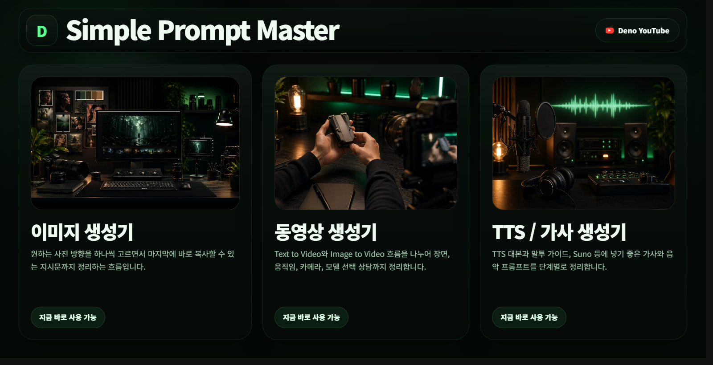

# Simple Prompt Master

이미지, 동영상, TTS/음악 생성 프롬프트를 단계별로 정리하는 정적 웹 프롬프트 빌더입니다.

[라이브 페이지 열기](https://deno2026.github.io/Deno-Image-Prompt-builder/)



## 프로젝트 소개

Simple Prompt Master는 프롬프트를 처음 쓰는 사람도 부담 없이 시작할 수 있도록 만든 보조 도구입니다. 사용자는 눈에 띄는 카드들을 클릭하며 원하는 방향을 고르고, 마지막에는 ChatGPT, Gemini 같은 LLM에 붙여넣기 좋은 상담형 지시문을 복사합니다.

핵심 목표는 사용자가 모든 것을 처음부터 글로 설명하지 않아도 되게 만드는 것입니다. 빌더가 큰 흐름과 선택지를 정리하고, LLM은 그 선택 내용을 바탕으로 빠진 정보를 되묻고 최종 프롬프트를 더 능동적으로 다듬도록 안내합니다.

## 현재 구성

| 페이지 | 상태 | 역할 |
| --- | --- | --- |
| `index.html` | 사용 가능 | 이미지, 동영상, TTS/음악 빌더로 들어가는 메인 허브 |
| `image.html` | 사용 가능 | 사진 종류, 주제, 분위기, 구도 등을 고르고 이미지 생성용 LLM 지시문을 복사 |
| `video.html` | 사용 가능 | Text to Video와 Image to Video 흐름을 나누어 영상 프롬프트 상담 지시문을 복사 |
| `tts.html` | 사용 가능 | TTS 대본, 말투 가이드, 가사/음악 프롬프트를 단계별로 정리 |

## 사용 흐름

1. 메인 페이지에서 작업할 생성기 선택
2. 카드형 선택지를 클릭하며 방향 정리
3. 필요한 경우 직접 입력으로 세부 맥락 추가
4. 마지막 화면에서 지시문 복사
5. ChatGPT, Gemini, Grok 등 대화형 LLM에 붙여넣고 추가 질문에 답변
6. LLM이 최종 이미지, 영상, 음성, 음악 프롬프트를 정리

## 설계 방향

- 프롬프트 빌더는 정답을 강제하는 도구가 아니라 상상력을 보완하는 보조 도구입니다.
- 초보자가 피로하지 않도록 입력칸보다 클릭 흐름을 우선합니다.
- 최종 결과는 바로 프롬프트를 끝내기보다, LLM이 사용자에게 부족한 정보를 되묻는 상담형 구조를 지향합니다.
- 영상 모델처럼 형식 차이가 큰 영역은 LLM이 사용할 모델을 먼저 묻고 공식 가이드를 참고하도록 안내합니다.
- Image to Video는 사용자가 이미지를 첨부해 LLM과 편하게 상담할 수 있도록 친절한 안내 흐름에 집중합니다.

## 파일 구조

- `index.html`: 메인 허브 페이지
- `image.html`: 이미지 생성 프롬프트 빌더
- `video.html`: 동영상 생성 프롬프트 빌더
- `tts.html`: TTS / 음악 프롬프트 빌더
- `assets/cards/`: 각 선택 카드에 사용되는 WebP 이미지
- `assets/readme/main-page.png`: README용 메인 페이지 스크린샷
- `scripts/`: 카드 이미지 교체, 매니페스트, 생성 계획 관리 스크립트
- `favicon.svg`: 사이트 아이콘

## 배포

별도 빌드 과정 없이 GitHub Pages에서 정적 HTML로 배포됩니다.

```text
https://deno2026.github.io/Deno-Image-Prompt-builder/
```

## GitHub About 권장값

- Description: `이미지, 동영상, TTS/음악 프롬프트를 클릭 흐름으로 정리하는 Simple Prompt Master`
- Website: `https://deno2026.github.io/Deno-Image-Prompt-builder/`
- Topics: `prompt-builder`, `ai-tools`, `image-generation`, `video-generation`, `tts`, `korean`
