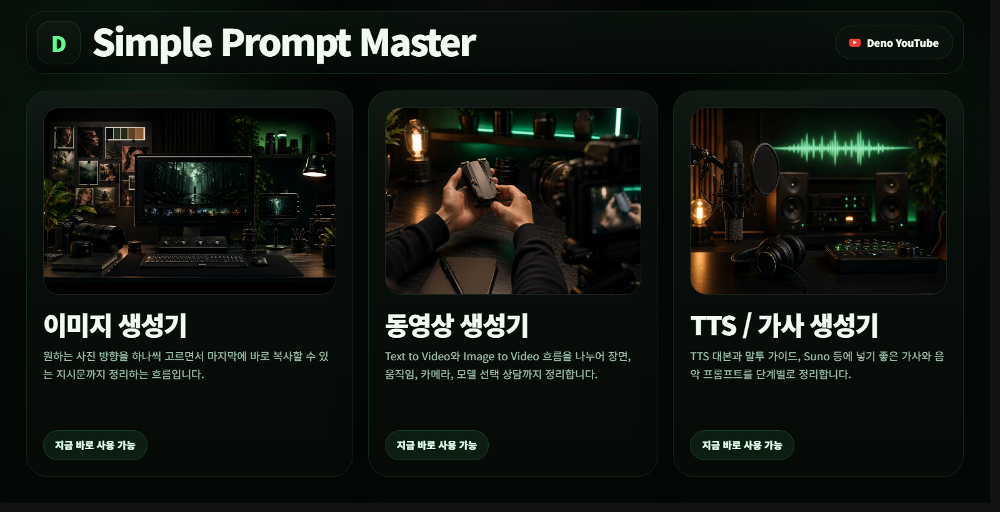

# Simple Prompt Master

이미지와 동영상 생성 프롬프트를 단계별로 정리하는 정적 웹 프롬프트 빌더입니다.

[라이브 페이지 열기](https://deno2026.github.io/Deno-Image-Prompt-builder/)



## 프로젝트 소개

Simple Prompt Master는 프롬프트를 처음 쓰는 사람도 부담 없이 시작할 수 있도록 만든 보조 도구입니다. 사용자는 눈에 띄는 카드들을 클릭하며 원하는 방향을 고르고, 마지막에는 ChatGPT, Gemini 같은 LLM에 붙여넣기 좋은 상담형 지시문을 복사합니다.

핵심 목표는 사용자가 모든 것을 처음부터 글로 설명하지 않아도 되게 만드는 것입니다. 빌더가 큰 흐름과 선택지를 정리하고, LLM은 그 선택 내용을 바탕으로 빠진 정보를 되묻고 최종 프롬프트를 더 능동적으로 다듬도록 안내합니다.

## 현재 구성

| 페이지 | 상태 | 역할 |
| --- | --- | --- |
| `index.html` | 사용 가능 | 이미지와 동영상 빌더로 들어가는 메인 허브 |
| `image.html` | 사용 가능 | 사진 종류, 주제, 분위기, 구도 등을 고르고 이미지 생성용 LLM 지시문을 복사 |
| `video.html` | 사용 가능 | Text to Video와 Image to Video 흐름을 나누어 영상 프롬프트 상담 지시문을 복사 |
| `tts.html` | 준비중 | TTS / 오디오 항목은 아직 준비중입니다 |
| `v1/index.html` | 구버전 | 2026.03.20 기준 프롬프트 빌더 v1.0 단일 페이지 |

## 사용 흐름

1. 메인 페이지에서 작업할 생성기 선택
2. 카드형 선택지를 클릭하며 방향 정리
3. 필요한 경우 직접 입력으로 세부 맥락 추가
4. 마지막 화면에서 지시문 복사
5. ChatGPT, Gemini, Grok 등 대화형 LLM에 붙여넣고 추가 질문에 답변
6. LLM이 최종 이미지 또는 영상 프롬프트를 정리

### 선택한 내용은 어떻게 복사되나요?

[동영상 빌더](https://deno2026.github.io/Deno-Image-Prompt-builder/video.html)의 **Text to Video**에서 다음 카드를 선택한 예입니다. 각 단계의 세부 입력과 마지막 추가 메모는 비워둡니다.

| 단계 | 선택 |
| --- | --- |
| 영상 종류 | 풍경 / 감성 컷 |
| 집중 포인트 | 빛 / 분위기 |
| 컷 구성 | 한 컷만 |
| 카메라 | 고정 |
| 움직임 | 배경 요소 중심 |
| 속도감 | 천천히 / 여운 있게 |
| 분위기 | 감성적으로 |

**LLM 상담 지시문 복사**를 누르면 아래 선택 내용이 상담 지시문에 포함됩니다. 다음은 실제 복사물의 마지막 부분입니다.

```text
[Builder Choices]
Video type: landscape or atmospheric scenic shot
Primary focus: lighting and atmosphere should establish the scene first
Shot structure: single-shot video, one continuous scene
Camera plan: static camera, steady framing
Primary motion: environmental motion like wind, particles, water, or lighting changes
Pacing and rhythm: slow pacing with gentle timing and more lingering moments
Tone and style: soft emotional atmosphere, lyrical and immersive

[Extra Notes From User]
(none)
```

전체 복사물에는 사용할 영상 모델을 먼저 확인하고, 필요한 세부사항을 질문한 뒤 해당 모델에 맞는 최종 프롬프트를 작성하라는 안내도 들어 있습니다. 복사한 지시문을 ChatGPT나 Gemini에 붙여넣고 사용할 모델과 원하는 풍경을 알려주면 됩니다.

## 설계 방향

- 프롬프트 빌더는 정답을 강제하는 도구가 아니라 상상력을 보완하는 보조 도구입니다.
- 초보자가 피로하지 않도록 입력칸보다 클릭 흐름을 우선합니다.
- 최종 결과는 바로 프롬프트를 끝내기보다, LLM이 사용자에게 부족한 정보를 되묻는 상담형 구조를 지향합니다.
- 영상 모델처럼 형식 차이가 큰 영역은 LLM이 사용할 모델을 먼저 묻고 공식 가이드를 참고하도록 안내합니다.
- Image to Video는 사용자가 이미지를 첨부해 LLM과 편하게 상담할 수 있도록 친절한 안내 흐름에 집중합니다.

## 파일 구조

- `index.html`: 메인 허브 페이지
- `image.html`: 이미지 생성 프롬프트 빌더
- `video.html`: 동영상 생성 프롬프트 빌더
- `tts.html`: TTS / 오디오 준비중 안내 페이지
- `v1/index.html`: 프롬프트 빌더 v1.0 구버전 페이지
- `assets/cards/`: 각 선택 카드에 사용되는 WebP 이미지
- `assets/readme/main-page.png`: README용 메인 페이지 스크린샷
- `scripts/`: 카드 이미지 교체, 매니페스트, 생성 계획 관리 스크립트
- `favicon.svg`: 사이트 아이콘

## 배포

별도 빌드 과정 없이 GitHub Pages에서 정적 HTML로 배포됩니다.

```text
https://deno2026.github.io/Deno-Image-Prompt-builder/
```

## 구버전

이전 단일 페이지가 필요하면 [프롬프트 빌더 v1.0](https://deno2026.github.io/Deno-Image-Prompt-builder/v1/)을 열 수 있습니다. 현재 이미지·동영상 빌더는 [라이브 페이지](https://deno2026.github.io/Deno-Image-Prompt-builder/)에서 시작하세요.

## 라이선스

이 프로젝트는 [GNU GPL v3.0](LICENSE) (`GPL-3.0-only`)으로 배포됩니다. 사용, 학습, 수정, 재배포, 상업적 이용이 가능합니다. 수정본을 배포할 때는 GPL-3.0을 따라야 하며 필요한 라이선스와 저작권 고지를 유지해야 합니다.

## GitHub About 권장값

- Description: `이미지와 동영상 프롬프트를 클릭 흐름으로 정리하는 Simple Prompt Master`
- Website: `https://deno2026.github.io/Deno-Image-Prompt-builder/`
- Topics: `prompt-builder`, `ai-tools`, `image-generation`, `video-generation`, `korean`
